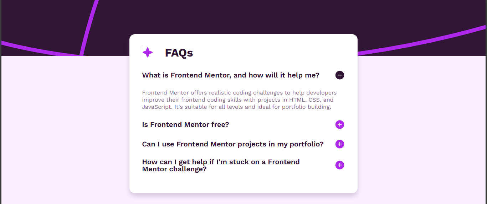

# Frontend Mentor - FAQ Accordion Coding Challenge Solution

## Overview

This is my submission for the [FAQ Accordion Coding Challenge](https://www.frontendmentor.io) from Frontend Mentor. Overall, the project was a delightful experience, offering a chance to test and improve my skills.

## Table of Contents

- [Overview](#overview)
- [Features](#features)
- [Technologies Used](#technologies-used)
- [What I Learned](#what-i-learned)
- [Challenges Faced](#challenges-faced)
- [Acknowledgments](#acknowledgments)
- [Connect with Me](#connect-with-me)

## Features

- Users can hide/show answers to questions by clicking on them.
- Interactive hover and focus states for better user experience.
- Responsive design optimized for both mobile and desktop screens.
- Accessible keyboard navigation for all interactive elements.

## Technologies Used

- **HTML** for structure.
- **CSS** with:
  - Flexbox for layout.
  - Relative units for responsiveness.
  - `:root` property to define reusable variables.
- **JavaScript** for interactivity.

## What I Learned

1. Gained more confidence in using **CSS Flexbox** for responsive layouts.
2. Explored defining styles using the `:root` property, which improved code maintainability.
3. Navigated through challenges in **JavaScript implementation** to make the accordion functional.

## Challenges Faced

While the CSS portion was manageable, implementing the JavaScript functionality was a bit tasking. However, it provided a great learning opportunity, and with persistence, I got everything to work as intended.

## Acknowledgments

Thanks to [Frontend Mentor](https://www.frontendmentor.io) for providing this challenge. It's been a rewarding journey, enhancing both my problem-solving and coding skills.

## Connect with Me

Feel free to reach out or view my other projects on:

- [LinkedIn](https://www.linkedin.com/in/oladosuabayomi)
- [Twitter](https://x.com/abayomi_oladosu)
- [GitHub](https://github.com/oladosuabayomi)

---

This project was a wonderful experience, and I look forward to tackling more challenges like this 🙏!
